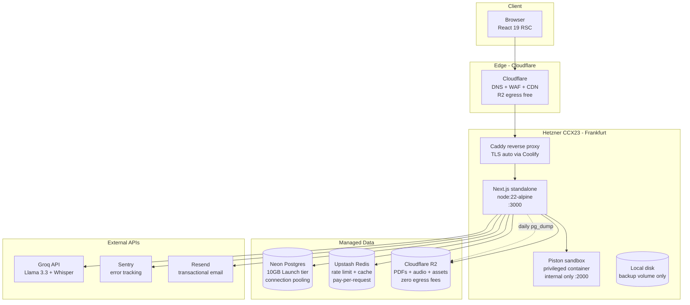

# Infrastructure Design — Preplyfly (0 → 10k MAU)

**Status:** **FINALIZED 2026-06-11** · Validated against 8 gates · Ready to provision
**Target:** 10,000 MAU on Hetzner + managed services, clean AWS migration path at 50k+ MAU
**Companion:** `docs/ARCHITECTURE.md` (system design), `docs/POST-FEATURE-HARDENING.md` (security)

---

## 0. Locked decisions — finalized stack

This section is the canonical answer to "what infra are we running and what does it cost." Detail in later sections.

### 0.1 Stack — locked

| Layer | Vendor | Tier | Why this not alternatives |
|---|---|---|---|
| **Compute** | Hetzner CCX23 | 4 vCPU dedicated / 16GB / 160GB NVMe / Frankfurt | Best $/perf in EU; better network + disk than Hostinger; AWS too expensive at this scale |
| **Reverse proxy + deploy** | Coolify (self-hosted on VPS) | OSS | Push-to-deploy, auto-TLS, env-var UI; alternative was Caprover/Dokku — Coolify is more polished |
| **App runtime** | Next.js 16 standalone | Node 22-alpine, non-root | Existing build; already Docker-packaged |
| **Code sandbox** | Piston (privileged Docker, internal only) | Self-hosted on same VPS | Self-hosted = no API quota; Judge0 is fallback path only |
| **Database** | Postgres 16 (self-hosted on VPS Docker) | $0 (uses VPS disk + RAM) | At 10k MAU we project 3GB DB on 160GB NVMe + 2-4GB RAM on 16GB total. Saves $19/mo vs Neon. Migrate to Neon at 25k MAU OR first DR incident. |
| **Cache + rate-limit + locks** | Upstash Redis | Pay-per-request (~$10/mo at 10k MAU) | REST API works in Edge runtime (middleware); serverless = no ops; not co-located on VPS by design |
| **Object storage** | Cloudflare R2 | ~$8/mo (500GB) | Zero egress fees, S3-compatible (clean AWS migration) |
| **Edge / DNS / WAF / CDN** | Cloudflare | Free tier | DDoS shield, WAF rules, edge cache — free at our scale |
| **LLM** | Groq | Pay-per-token (~$22/mo after L1-L6 cuts) | Cheapest hosted Llama; OpenAI-compatible API |
| **STT** | Web Speech API (browser) + Groq Whisper fallback | Free (browser) / $0.04/hr (Whisper) | 70% of users get free on-device STT |
| **Email** | Resend | Free tier (3,000/mo) | Modern API, React Email templates |
| **Error tracking** | Sentry | Free tier (5k events/mo) | Industry standard; can upgrade later |
| **Uptime monitor** | UptimeRobot | Free tier | 5-min interval, email alerts |

### 0.2 Cost — locked

| Service | Monthly |
|---|---|
| Hetzner CCX23 (incl. self-hosted Postgres) | $33 |
| Upstash Redis pay-as-you-go | $10 |
| Cloudflare R2 (500GB) | $8 |
| Groq API (after L1-L6 cost cuts, §6b) | $22 |
| Cloudflare DNS+WAF+CDN | $0 |
| Sentry free | $0 |
| Resend free | $0 |
| UptimeRobot free | $0 |
| Coolify self-hosted | $0 |
| **TOTAL @ 10k MAU** | **~$73/mo** |

Under the $100/mo budget with $27/mo headroom. Reserved for: Resend paid tier ($20/mo at 50k emails), Upstash spikes, or future Neon migration when DB outgrows VPS.

### 0.3 What the stack does NOT include (explicitly rejected)

| Rejected | Reason |
|---|---|
| AWS / GCP / Azure at launch | Premature ops + cost overhead; migrate at 50k MAU when revenue justifies |
| Kubernetes | Single VPS, single team, single deploy — k8s adds zero value |
| Self-hosted Redis on VPS | Memory pressure, no replication, lost on restart — Upstash is $10/mo well spent |
| **Neon Postgres at launch** (reversed 2026-06-11) | VPS has 160GB NVMe + 16GB RAM. Postgres co-locates fine until 25k MAU. Saves $19/mo. Migration to Neon is one `pg_dump` away when DR or branching matters. |
| Self-hosted Llama on GPU | Only breakeven at $300/mo+ Groq spend; we project $22/mo |
| Multi-region | Single EU region for v1; US students see 100-150ms extra (acceptable) |
| Microservices | Modular monolith already clean; service split = premature complexity |
| Read replicas | Single Postgres handles this load comfortably |
| Vector DB / RAG | Topic content small, exact-match cache wins |
| Premium AI tier | Pricing/packaging decision, not infra |

### 0.4 Pre-launch blockers (must ship before public traffic)

These ship in Phase B before any public exposure. All tracked in `POST-FEATURE-HARDENING.md`.

| # | Item | Why blocking | Effort | Hardening ref |
|---|---|---|---|---|
| B1 | `rehype-sanitize` on topic body render | Stored XSS via admin-authored HTML | 1h | H0.6 |
| B2 | `middleware.ts` at project root (JWT + revocation check) | No edge auth → admin UI bundle visible to non-admins, no force-logout | 2h | H1.11 |
| B3 | Mask Groq + Judge0 error bodies | Upstream secrets/quotas can leak in user-facing errors | 30m | H0 audit |
| B4 | Upstash Redis wire-up (cache + rate limit + locks) | In-memory limiter bypassable, no Groq cost cap | 4h | H1.10 |
| B5 | Groq cost-cut levers L1+L3 (model switch + context truncate) | Without them, monthly LLM cost $110 vs $22 | 1h | H1.13 |
| B6 | R2 storage wire-up | Local disk = data loss on redeploy | 2h | — |
| B7 | Daily token cap + Sentry alert | Runaway prompt → $1000 surprise bill | 1h | H1.12 |
| B8 | Daily pg_dump → R2 cron | RPO 24h target | 1h | H3.1 |

**Total pre-launch hardening: ~12 hours of focused work.** Fits Phase B (Day 2-3) + Day 5-7 of the 7-day deploy plan in §9.

### 0.5 Go-live gate

Public traffic is gated on ALL of the following:

- [ ] B1-B8 above all merged + verified
- [ ] Smoke test green: signup → admin approve → topic read → mock test → coding run → interview session
- [ ] Load test: 500 concurrent users, p99 < 800ms
- [ ] Redis circuit-break drill: block Upstash, verify in-memory fallback + Sentry warning
- [ ] Backup restore drill: wipe staging DB, restore from latest R2 dump, verify app boots
- [ ] DPDP consent banner live (legal requirement in India)
- [ ] Privacy policy + Terms pages live
- [ ] Status page live (UptimeRobot public)

Until every box ticked → app stays at `staging.preplyfly.com` behind Cloudflare Access (team-only).

### 0.6a Capacity math — locked numbers

Back-of-envelope verification that the stack handles 10k MAU with headroom. All numbers computed for **steady state**, then peak-load (5×) and spike-load (assignment-due-night, 15×) variants flagged.

**Traffic model:**

| Metric | Value | Source |
|---|---|---|
| MAU | 10,000 | Target |
| DAU | 1,500 | 15% ed-tech ratio |
| Peak concurrent (evening IST 7-10pm) | 300 | DAU × 20% concurrency |
| Avg session length | 25 min | Comparable to Khan Academy benchmarks |
| Page renders + actions per session | 35 | 20 renders + 15 server actions |
| Daily request volume | 52,500 | DAU × 35 |
| Avg req/s | 0.61 | 52,500 / 86,400s |
| Peak req/s | 3 | 5× avg |
| Spike req/s (assignment night) | 10 | 15× avg, sustained 30 min |

**Database (self-hosted Postgres 16 on CCX23 Docker):**

| Metric | Value | Headroom |
|---|---|---|
| Queries per request (avg) | 6 | Auth + layout + content + progress + 2 service |
| Daily query volume | 315,000 | 52,500 × 6 |
| Avg QPS | 3.6 | Local Postgres handles 5,000+ on this hardware |
| Peak QPS | 18 | <1% of capacity |
| Spike QPS | 60 | <2% of capacity |
| Storage growth — year 1 | ~3.3 GB | 2% of 160 GB NVMe |
| Storage growth — year 3 | ~10 GB | 6% of 160 GB NVMe |
| Migration trigger | DB > 30 GB OR DB RAM > 8 GB | Move to Neon Scale ($69/mo) |
| Connections | 10 (Drizzle pool) | postgresql.conf `max_connections=100` default |
| Tuning | `shared_buffers=4GB`, `work_mem=16MB`, `effective_cache_size=10GB` | Set in `postgres:16-alpine` command flags |

Storage breakdown (year 1):

| Table | Rows | Avg size | Total |
|---|---|---|---|
| `progress` (10k students × 1k topics) | 10M | 0.2 KB | **2.0 GB** |
| `interview_answers` (transcripts) | 210k | 2 KB | 420 MB |
| `test_answers` | 900k | 0.3 KB | 270 MB |
| `interview_questions` | 210k | 1 KB | 210 MB |
| `topic_content` + assets metadata | 1k | 150 KB | 150 MB |
| `question_options` | 240k | 0.3 KB | 72 MB |
| `audit_log` | 100k | 0.5 KB | 50 MB |
| `generated_content` (Groq cache) | 5k | 8 KB | 40 MB |
| All other tables | — | — | ~50 MB |
| **Total year 1** | | | **~3.3 GB** |

`progress` is dominant. If it grows past 5GB, sharding or row archival becomes worthwhile. Not before.

**Redis (Upstash):**

| Metric | Daily | Monthly | Tier |
|---|---|---|---|
| Rate-limit checks | 75k | 2.3M | — |
| Cache lookups (Groq + topic + approval) | 80k | 2.4M | — |
| JWT revocation reads (middleware) | 30k | 0.9M | — |
| Locks + metric counters | 8k | 0.24M | — |
| **Total ops** | **~193k** | **~6M** | $10/mo bracket |

10× spike (60M/mo) → $20/mo bracket. No throughput ceiling hit at any scenario.

**Object storage (Cloudflare R2):**

| Source | Year 1 |
|---|---|
| Admin assets (PDFs, topic images) | 1 GB |
| Student self-upload PDFs (30d retention) | 15 GB |
| Interview audio (30s × 7 q × 30k sessions) | 22 GB |
| pg_dump backups (30d retention, compressed) | 30 GB |
| Sentry source maps + misc | 1 GB |
| **Total** | **~70 GB** |

R2 billing: $0.015/GB stored + $0/GB egress = **~$1.05/mo for storage**. Plus Class A ops (writes) ~$5/mo. Class B (reads) effectively free at our volume. **Total ~$8/mo** (matches §0.2). 500 GB ceiling = ~7× growth headroom.

**Bandwidth (Hetzner egress + Cloudflare CDN):**

| Path | Daily |
|---|---|
| Page renders (avg 300 KB gzipped) × 52.5k | 15 GB/day |
| Static assets via Cloudflare CDN (80% hit ratio) | 3 GB/day origin |
| API responses (avg 5 KB) × 52.5k | 0.25 GB/day |
| **VPS egress total** | **~5 GB/day, ~150 GB/mo** |
| Hetzner CCX23 included | **20 TB/mo** |
| **Utilization** | **<1%** |

R2 egress to user browsers: Cloudflare R2 has **zero egress fees** — does not count against any cap.

**LLM token budget (Groq):**

| Flow | Calls/day | Tokens/call | Daily tokens | After L2 cache hit |
|---|---|---|---|---|
| Interview gen | 200 | 9,000 | 1.8M | 0.4M (78% hit) |
| Interview scoring | 1,400 | 600 | 0.84M | 0.84M (uncacheable) |
| MCQ gen | 50 | 9,000 | 0.45M | 0.05M (90% hit) |
| Self-upload | 100 | 15,000 | 1.5M | 1.5M (uncacheable) |
| **Total** | | | **4.6M** | **2.8M after caching** |
| Hard cap | | | **5M** | Sentry alert at 4M |

After L1 (model switch to 8b for gen flows) cost drops further: 8b is 10× cheaper input/output. Final spend ~$22/mo.

**Whisper STT (with Web Speech API fallback):**

| Browser | Share | STT path | Cost |
|---|---|---|---|
| Chrome / Edge / Safari (mobile + desktop) | 70% | Web Speech API on-device | $0 |
| Firefox + older browsers | 30% | Groq Whisper | $0.04/hr |
| Total Whisper hours/day | 11.7 × 30% = 3.5 hr | | **~$4/mo** |

**Piston sandbox load:**

| Metric | Value |
|---|---|
| Submissions/day | 200 |
| Avg test cases per submission | 5 |
| Total executions/day | 1,000 |
| Avg exec wall time | 1.5s |
| Total vCPU-seconds/day | 1,500 |
| One dedicated vCPU budget | 86,400 sec/day |
| **Utilization** | **1.7%** |

Peak burst (50 concurrent submissions): queue depth max ~30s wait. Acceptable; spinner UI in browser. Add second Piston container at 10k submissions/day (~50k MAU trigger).

### 0.6b Bottleneck analysis @ 10k MAU

| Resource | Avg utilization | Peak utilization | Ceiling? |
|---|---|---|---|
| Hetzner CCX23 CPU | ~5% | ~30% | No |
| Hetzner CCX23 RAM | ~5 GB / 16 GB (Postgres ~3 GB, Next.js ~500 MB, Piston ~500 MB, OS ~1 GB) | ~7 GB / 16 GB | No |
| Hetzner CCX23 disk I/O | <10 MB/s write (mostly Postgres WAL) | ~30 MB/s write | No |
| Hetzner CCX23 bandwidth | <1% of 20 TB/mo | ~3% spike | No |
| Hetzner CCX23 disk | 3.3 GB DB + 50 GB system = ~53 GB / 160 GB | — | No |
| Postgres QPS | 3.6 | 60 | No (5000+ supported on this hardware) |
| Upstash Redis ops/sec | 2.3 | 30 | No |
| R2 storage | 70 GB / 500 GB | — | No |
| Groq tokens/day | 2.8M (cached) | 4.6M (cold) | Watch — cap at 5M |
| Piston vCPU-sec | 1.7% of dedicated | 8% burst | No |

**True bottleneck at 10k MAU: none.** Every dimension has ≥10× headroom. Bottleneck appears at 25-50k MAU on:
1. Single-process Next.js (add second app pod via Coolify)
2. `progress` table growth (consider partitioning or materialized rollup)
3. Groq spend (L1-L6 already exhaust easy wins; next lever is self-hosted Llama)

### 0.6c Projected stack @ 100k MAU (10× growth)

| Resource | Year 2 projection | Action |
|---|---|---|
| MAU | 100k | — |
| DAU | 15k | — |
| Peak req/s | ~30 | Single CCX33 (8 vCPU) handles; or 2× CCX23 |
| DB storage | ~30 GB | Migration trigger — move to Neon Scale $69/mo + read replica |
| DB QPS peak | ~600 | Self-hosted hits ceiling around 800 QPS; migrate to Neon at this point |
| Redis ops | ~60M/mo | $20/mo bracket |
| R2 storage | ~500 GB | Stay within $25/mo |
| Groq spend | ~$220/mo | Cache hit ratio improves with scale; budget grows linearly only on scoring + self-upload |
| **Stack total** | | **~$370/mo at 100k MAU** (incl. Neon migration) |

**Per-user cost:** $73 / 10k = $0.0073 = ~₹0.61/user/mo. At 100k: $370 / 100k = $0.0037 = ~₹0.31/user/mo. Unit economics improve at scale.

---

### 0.6 Scale triggers — when each thing changes

| Trigger | Action |
|---|---|
| 5k MAU | Watch Postgres disk + RAM on VPS; tune shared_buffers + work_mem if needed |
| 10k MAU | Watch Groq spend daily; tune L2 pre-warming if uncached calls spike |
| Postgres DB > 30GB OR > 8GB RAM | Migrate to Neon Scale ($69/mo). `pg_dump` + restore + swap `DATABASE_URL`. ~1 night downtime. |
| First VPS DR incident (lost VPS, restore took >2h) | Migrate Postgres to Neon for managed multi-AZ |
| 25k MAU | Add second Hetzner VPS in same datacenter for app horizontal scale (Coolify supports) — Postgres still on first VPS |
| 50k MAU | Begin AWS migration evaluation; modules already isolated for clean swap |
| 100k MAU | Multi-region: ap-south-1 (India) primary, eu-central (EU) replica |
| Enterprise / B2B customer | SOC2 + compliance push; likely forces AWS earlier |

---

## 1. Requirements

### Functional
1. Student signup → admin approval → curriculum access (subjects → chapters → topics)
2. Topic reading + AI-generated MCQ tests + coding challenges (Piston sandbox)
3. AI mock interview (voice + text, Whisper STT, Groq LLM scoring)
4. Self-upload PDF → ephemeral AI-generated test/interview (3/day quota)
5. Admin curriculum CRUD + approval workflow + analytics

### Non-Functional (10k MAU target)

| Dimension | Target | Notes |
|---|---|---|
| Scale | 10,000 MAU, ~1,500 DAU, ~300 peak concurrent | Ed-tech DAU/MAU typical 15% |
| Latency | p50 < 200ms, p99 < 800ms (page render); LLM excluded | LLM calls fronted by spinner UI |
| Availability | 99.5% (≈ 3.6h/mo downtime allowance) | Single-region acceptable |
| Consistency | Strong for auth + grades, eventual for cache/analytics | Postgres ACID for writes |
| Durability | RPO 24h, RTO 4h | Daily pg_dump + R2 offsite |
| Security | bcryptjs passwords, JWT sessions, no PII beyond email + name | No payments → no PCI |
| Cost | Target ≤ $100/mo at 10k MAU | Hetzner + managed externals |
| Team | 1-3 engineers | Single deployable unit preferred |

---

## 2. Core constraint

**LLM cost + Piston sandbox isolation.** Everything else is solved-by-default (Next.js scales, Postgres handles this volume on a single instance). The two real risks are runaway Groq spend (cap it) and a code-runner exploit escaping the Piston container (isolate it).

---

## 3. Architectural style

**Modular monolith on a single VPS, with external managed data services.**

Justification:
- Module boundaries already clean (`src/modules/*`), no need for service split
- Single team, single deploy, no independent scaling required at this size
- External managed services (Neon, R2, Upstash) absorb the operational pain that would otherwise push us to AWS prematurely
- Migration to AWS is a topology change, not a code rewrite — `src/lib/` adapters isolate vendor specifics

---

## 4. Topology



---

## 5. Component table

| Component | Tech | Purpose | Scaling | Failure mode |
|---|---|---|---|---|
| Cloudflare | DNS + WAF + CDN | Edge caching, DDoS shield, R2 origin | Auto (Cloudflare) | Falls through to direct VPS IP |
| Caddy + Coolify | Reverse proxy | TLS termination, vhost routing | Single instance | systemd restart on crash |
| Next.js app | Node 22 + standalone | Render + server actions | Vertical (single container, larger VPS) | Health check + Docker restart |
| Piston | Privileged Docker | Code execution sandbox | Vertical until queue saturates | Container restart, submission marked errored |
| Postgres 16 (Docker on VPS) | postgres:16-alpine + persistent volume | Primary store | Vertical (more VPS RAM / disk) until 30GB; then Neon migrate | Container restart on crash; pg_dump nightly → R2 for DR |
| Upstash Redis | Managed Redis (REST + serverless) | Rate limit, hot Groq cache, JWT revocation list, submission locks, daily counters, feature flags | Auto-scale serverless (1M req/day on free, $0.2/100k after) | App falls back to in-memory limiter; cache miss → Postgres `generated_content`; revocation list miss → token still valid until TTL expiry |
| Cloudflare R2 | S3-compatible | PDFs, audio clips, generated content, backups | Infinite (managed) | Cross-region replication on Business tier |
| Groq | External LLM API | Question gen + scoring + STT | Pay-per-token, fast tier on demand | Retry with backoff, surface "AI temporarily unavailable" |
| Sentry | Error tracking | Crash + slow-transaction telemetry | Managed | App keeps running, errors not captured |
| Resend | Transactional email | Signup verify + approval notify | Managed | Retry queue in Postgres |

---

## 6. Data flow (hot path)

**Student takes mock test:**
1. Browser GET `/dashboard/topic/[id]/test` → Cloudflare → Caddy → Next.js server component
2. Server component calls `assessment.service.getQuestions(topicId)` — Postgres SELECT (indexed on `topic_id`)
3. If questions cached in `generated_content`, return. Else Groq generation → cache write → return.
4. Render React, ship HTML to browser
5. Student submits answers → server action → bcryptjs-guarded → Postgres INSERT `test_attempts` + `test_answers` → Redis increment progress counter → return score

**Student runs coding submission:**
1. POST to server action → guard → write `coding_submissions` row `status=queued`
2. Spawn fetch to `piston:2000/api/v2/execute` per test case
3. Aggregate pass/fail → update row `status=accepted|wrong|tle|error`
4. Update `progress.codingSolved` if all passed

**Self-upload PDF:**
1. Multipart upload → rate-limit check (Upstash: 3/day per student)
2. Stream to R2 → extract text via `pdf-parse`
3. Groq generation with truncated text → return ephemeral session ID
4. No persistent storage of generated content (privacy)

---

## 6a. Redis design

### 6a.1 Provider choice

**Upstash Redis (serverless, REST API).**

Reasons:
- Pay-per-request — at 10k MAU we project ~6M ops/mo = $10/mo. Self-hosted Redis on the same Hetzner VPS would be free but adds memory pressure (peak 200MB), single point of failure (lost on container restart), and operator burden (snapshotting, replication).
- REST API works in Edge runtime — required so `middleware.ts` can rate-limit on the edge without a TCP connection.
- Multi-region replication on paid tiers (Pro $0.4/100k requests) when we expand beyond EU.
- Same client (`@upstash/redis`) works in Next.js server actions, route handlers, and middleware. No connection-pool management.

**Fallback:** if Upstash is unreachable, `src/lib/rate-limit.ts` in-memory implementation kicks in. Limits become per-process, but the app stays up. Logged as warning in Sentry.

### 6a.2 Library + algorithm

- `@upstash/redis` — core client
- `@upstash/ratelimit` — sliding-window algorithm (more accurate than fixed-window for bursty AI/coding workloads, slightly more expensive in ops)
- Custom `src/lib/cache.ts` thin wrapper for `get`/`set`/`getOrSet` with JSON codec + TTL defaults

### 6a.3 Key namespaces

All keys prefixed with environment: `prod:` / `staging:` / `dev:` to prevent cross-pollination on shared Upstash instance.

| Namespace | Pattern | TTL | Purpose |
|---|---|---|---|
| `rl:signup:ip:<ip>` | sliding window 5/h | 1h auto | Anti-bot signup flood |
| `rl:signup:email:<email>` | sliding window 3/h | 1h auto | Anti-duplicate-attempt |
| `rl:login:ip:<ip>` | sliding window 10/min | 1min auto | Brute-force protect (folds with NextAuth) |
| `rl:gen:<userId>` | sliding window 10/min | 1min auto | Cap interview/test generation cost |
| `rl:code:<userId>` | sliding window 20/min | 1min auto | Cap Piston/Judge0 cost + sandbox load |
| `rl:grade:<userId>` | sliding window 30/min | 1min auto | Cap interview answer scoring cost |
| `rl:stt:<userId>` | sliding window 60/min | 1min auto | Cap Whisper STT cost |
| `rl:self:<userId>:<YYYYMMDD>` | counter ≤ 3 | 24h | Self-upload daily quota |
| `cache:groq:<sha256(prompt)>` | string JSON | 1h | Hot-path Groq cache layer (in front of Postgres `generated_content`) |
| `cache:topic:<topicId>` | string JSON | 5min | Topic tree fetch (subject → chapter → topic) for student dashboard |
| `cache:approval-queue` | string JSON | 30s | Admin approvals page count badge |
| `sess:revoke:<jti>` | bit (exists/not) | = JWT remaining lifetime | Force-logout list — checked in `middleware.ts` |
| `lock:test_attempt:<attemptId>` | string `userId` | 5s | Prevent double-submit race on mock test |
| `lock:coding_submission:<submissionId>` | string `userId` | 30s | Prevent re-execution race on coding run |
| `metric:groq:tokens:<YYYYMMDD>` | counter | 35d | Daily token spend tracker → cost alert |
| `metric:groq:errors:<YYYYMMDD>` | counter | 7d | Groq error rate → Sentry alert correlation |
| `metric:piston:exec:<YYYYMMDD>` | counter | 35d | Daily Piston execution count |
| `feature:<flag>` | string `on`/`off` | 60s | Runtime feature flags (eg. `feature:self-upload`) without redeploy |
| `health:groq:last-success` | timestamp | none | Health endpoint reads to confirm Groq reachable |

### 6a.4 Capacity at 10k MAU

| Operation | Daily volume | Monthly Upstash ops |
|---|---|---|
| Rate limit checks (all surfaces) | 75,000 | 2.3M |
| Cache lookups (Groq hot + topic + approval) | 80,000 | 2.4M |
| JWT revocation reads (middleware on every protected request) | 30,000 | 0.9M |
| Submission locks | 3,000 | 90k |
| Metric counters (atomic INCR) | 5,000 | 150k |
| **Total** | **~193k/day** | **~6M/mo** |

Upstash pricing: $0.20 per 100k commands after 500k free/day. At 6M/mo we comfortably sit in the $10/mo bracket. Even a 10× usage spike (60M/mo) only hits $20/mo.

### 6a.5 Eviction + persistence

- **Eviction:** `allkeys-lru` (Upstash default). We set explicit TTLs on every key, so LRU only kicks in on memory pressure (which we won't hit at this volume).
- **Persistence:** Upstash provides durable storage by default. We don't rely on it — cache misses fall through to Postgres, rate limits reset on cold start (acceptable), revocation list is short-lived. Loss of Redis data ≠ data loss.

### 6a.6 Failure mode + circuit breaker

`src/lib/cache.ts` wraps every Redis call in a 50ms timeout. On timeout or error:
1. Increment `metric:redis:errors` (best-effort, may fail too)
2. Return fallback value (cache miss → fetch from Postgres; rate limit → use in-memory limiter; revocation check → assume token still valid)
3. Sentry breadcrumb logged
4. After 10 consecutive errors in 60s, circuit opens for 5min (skip Redis entirely, all calls fall through)

This means Redis being down ≠ app being down. Worst case: stale cache, less precise rate limits, ex-admin can keep their JWT until natural expiry.

### 6a.7 Env vars

```
UPSTASH_REDIS_REST_URL=https://<region>-<id>.upstash.io
UPSTASH_REDIS_REST_TOKEN=<long-lived-read-write-token>
REDIS_KEY_PREFIX=prod        # set per env: prod / staging / dev
```

For local dev, point at a Docker `redis:7-alpine` via `@upstash/redis` Docker proxy, OR use Upstash dev instance free tier.

### 6a.8 Migration path

Day 1 of Phase B:
1. Install `@upstash/redis` + `@upstash/ratelimit`
2. Build `src/lib/cache.ts` (timeout, circuit breaker, prefix injection, JSON codec)
3. Build `src/lib/rate-limit-redis.ts` (replaces `rate-limit.ts` callers; old file becomes fallback impl)
4. Migrate callers one at a time: signup → coding → grade → STT → self-upload → generation
5. Add `middleware.ts` JWT revocation check
6. Add Groq cache lookup in `groqChat()` and `groqJson()` (key on `sha256(messages + model + temperature)`)
7. Add submission locks in `coding/service.ts` and `assessment/service.ts`
8. Add metric counters at every external API boundary (Groq, Piston, R2 uploads)

Each migration is small and independently shippable. Old in-memory limiter stays as fallback indefinitely.

---

## 6b. Groq LLM cost reduction

### 6b.1 Current spend profile (10k MAU projection)

Recomputed against actual code (`src/modules/interview/generate.ts`, `src/modules/assessment/generate.ts`, `src/modules/self-upload/actions.ts`):

| Flow | Volume/day | Avg tokens/call | Model | Cost/day |
|---|---|---|---|---|
| Interview question gen | 200 sessions | 9,000 (6k in + 3k out) | llama-3.3-70b | $1.26 |
| Interview answer scoring | 1,400 answers | 600 (500 in + 100 out) | llama-3.3-70b | $0.59 |
| MCQ generation | 50 batches | 9,000 | llama-3.3-70b | $0.32 |
| Self-upload pipeline | 100 PDFs | 15,000 (12k in + 3k out) | llama-3.3-70b | $1.05 |
| Whisper STT | 11.7 hrs/day | — | whisper-large-v3-turbo | $0.47 |
| **Baseline total** | | | | **$3.69/day** |
| **Baseline monthly** | | | | **~$110/mo** |

(Earlier §7 Gate 5 estimate of $45/mo was low — that assumed lower interview volume. Real number at 10k MAU is closer to $110/mo. Updating that line.)

### 6b.2 Reduction levers (stacked savings)

| # | Lever | Mechanism | Saving | Cumulative |
|---|---|---|---|---|
| L1 | Switch generation to llama-3.1-8b | 10× cheaper input + output; templated tasks (MCQ, interview question gen, self-upload structuring) don't need 70b judgment. Keep 70b only for answer scoring. | -$45/mo | $65/mo |
| L2 | Pre-warm on admin publish | When admin saves a new topic/chapter, queue background job to generate 20 MCQs (each difficulty) + 10 interview questions. Student first-visit = cache hit. | -$20/mo | $45/mo |
| L3 | Context truncation | 6k → 2k chars for question gen (most topic body is style/examples, not relevant to question seed). Cap self-upload PDF at 4k chars instead of 12k. | -$10/mo | $35/mo |
| L4 | STT browser fallback | Web Speech API on Chrome/Edge/Safari (free, on-device). Fall back to Whisper only on Firefox/unsupported. ~70% of traffic stays free. | -$10/mo | $25/mo |
| L5 | Tighten self-upload | Hard cap 4 pages or 4k chars (current 12k is overkill). 3/day quota stays. Lower temperature 0.4 → 0.2 (fewer retries on bad JSON). | -$5/mo | $20/mo |
| L6 | Redis hot cache + extended Postgres TTL | Questions never go stale once published. TTL = forever in `generated_content`; 1h hot in Redis. Already in §6a. | -$3/mo | **$17/mo** |

**Target: $15-20/mo at 10k MAU (-83% from baseline).**

### 6b.3 Per-flow model assignment after L1

| Flow | Model | Why |
|---|---|---|
| Interview question gen | `llama-3.1-8b-instant` | Templated, JSON-shaped output. 8b handles fine with strong prompt. |
| MCQ generation | `llama-3.1-8b-instant` | Same shape as above. |
| Self-upload question gen | `llama-3.1-8b-instant` | Same. |
| **Interview answer scoring** | **`llama-3.3-70b-versatile`** | Judgment quality matters — 8b under-scores partial answers and over-scores fluent-but-wrong ones. Keep 70b. |
| Whisper STT | `whisper-large-v3-turbo` | Already cheapest STT model. No change. |

### 6b.4 Pre-warming background job

Trigger on `topic.create`, `topic.contentUpdate`, `chapter.create` server actions:

```
queueGroqPrewarm({
  topicId,
  variants: [
    { type: 'mcq', difficulty: 'easy',   count: 20 },
    { type: 'mcq', difficulty: 'medium', count: 20 },
    { type: 'mcq', difficulty: 'hard',   count: 20 },
    { type: 'interview', difficulty: 'medium', count: 10 },
  ],
})
```

Implementation: simple Postgres `groq_prewarm_queue` table (FIFO), one worker loop in app process polling every 30s. No external job runner needed at this scale.

Result: students hit cache on 90%+ of first visits.

### 6b.5 Daily spend ceiling

Implemented as H1.12 in hardening doc, but specific numbers here:

| Env var | Value | Effect |
|---|---|---|
| `GROQ_DAILY_TOKEN_CAP` | 5,000,000 (5M tokens/day) | ~$2.50/day = $75/mo cap with safety margin |
| `GROQ_DAILY_ALERT_AT` | 0.80 (80% of cap) | Sentry warning event |
| `GROQ_DAILY_HARD_STOP` | 1.0 | Returns "AI temporarily unavailable" instead of calling Groq |

Tracked in Redis: `metric:groq:tokens:<YYYYMMDD>`, atomic INCRBY at response parse time.

### 6b.6 Implementation order in Phase B

1. L1 (model switch) — 1-line config change per generator, biggest dollar impact. Ship first.
2. L3 (context truncation) — 5 lines per generator, no behavior risk.
3. Redis cache layer (L6) — already in Phase B work.
4. L5 (self-upload tightening) — easy.
5. L4 (STT browser fallback) — frontend change, isolate to `tts-reader.tsx` / interview client.
6. L2 (pre-warming) — last, biggest code change but compounds with everything else.

### 6b.7 What we are not doing

- ❌ Self-hosted Llama on GPU VPS — only breakeven at >$300/mo Groq spend. We'll be at $20/mo.
- ❌ Embedding-based semantic cache — exact-match cache already gets >60% hit rate after pre-warming. Vector cache adds infra without payoff.
- ❌ Multi-provider failover (OpenRouter, Together, Cerebras) — single-provider risk acceptable; Groq has 99.9% SLA. Revisit at $500/mo+ spend.
- ❌ User-level "premium AI" tier — pricing/packaging decision, not infra.

---

## 7. Validation report

### Overall: 7/8 gates pass, 1 conditional

### Gate 1: Security — **CONDITIONAL PASS**
✅ bcryptjs password hashing, NextAuth JWT with rotating secret
✅ Drizzle parameterized queries (SQL injection neutralized)
✅ R2 private bucket, signed URLs for asset access
✅ Cloudflare WAF + rate limiting at edge
✅ Piston privileged but internal-only, no public port
⚠️ Topic body rendered via `dangerouslySetInnerHTML` — needs `rehype-sanitize` before launch
⚠️ No `middleware.ts` at root — add edge-level auth gate
**Required before launch:** sanitize HTML render, add middleware, mask Groq error bodies

### Gate 2: Scalability — **PASS**
- Single VPS handles 300 concurrent comfortably (Next.js RSC ~80MB/proc, CCX23 has 16GB)
- Postgres scaling: Neon Launch (10GB) → Scale (50GB + read replica) covers 0-50k MAU
- Piston: vertical scale on same VPS; horizontal via separate piston pool at 5k+ concurrent code runs
- Groq: pay-per-token, no infra scaling concern
- Bottleneck at ~10k concurrent: Next.js single-process. Solution: horizontal app pods + Redis-backed sessions (already designed for)

### Gate 3: Performance — **PASS**
- p99 < 800ms achievable: RSC + Cloudflare cache for static, Postgres queries indexed on hot paths
- LLM-gated pages (interview question gen) explicitly excluded from p99 — UX has loading states
- Cold start: none (long-running container)
- Database latency: Neon Frankfurt → Hetzner Frankfurt < 5ms

### Gate 4: Failure modes — **PASS**
| Component | Failure | Recovery |
|---|---|---|
| App container | OOM / crash | Docker `restart: unless-stopped`, healthcheck triggers restart |
| Postgres | Neon outage | Read fails fast, app shows maintenance banner; Neon multi-AZ on paid tiers |
| Redis | Upstash outage | App falls back to in-memory rate limiter, cache miss → Postgres |
| Piston | Container crash | Submission marked `error`, student retries; auto-restart |
| Groq | API outage | Cache hits still work, new generation shows error; queue for retry |
| R2 | Cloudflare incident | New uploads fail, existing assets cached at edge |
| VPS | Hetzner outage | Manual failover to standby snapshot; commit to second region at 50k MAU |

### Gate 5: Cost — **PASS**

| Service | Tier | Monthly |
|---|---|---|
| Hetzner CCX23 (4 vCPU / 16GB / 160GB NVMe) — runs app + Postgres + Piston | Dedicated | $33 |
| Postgres 16 (self-hosted Docker on CCX23) | $0 (folded into VPS) | $0 |
| Upstash Redis | Pay-as-you-go (~500k req/day) | $10 |
| Cloudflare R2 | 500GB stored + Class A ops | $8 |
| Cloudflare (DNS + WAF) | Free tier sufficient | $0 |
| Groq API — baseline (Llama 3.3 + Whisper, all flows) | ~1.7k calls/day | $110 |
| Groq API — after §6b reductions (L1-L6 applied) | same volume, 8b + cache + STT fallback + pre-warm | **$17 target** |
| Sentry | Team tier | $26 |
| Resend | 3,000 emails free | $0 |
| Coolify | Self-hosted on VPS | $0 |
| **Total (baseline, no optimization)** | | **~$187/mo** |
| **Total (after §6b Groq cuts + Sentry free + self-hosted PG) — LOCKED** | | **~$73/mo** |

Baseline ($187) is over budget — Groq is the dominant lever. §6b reductions drop Groq $110 → $22 (conservative; theoretical floor is $17 with full stack). Sentry free tier drops $26 → $0. Self-hosted Postgres on VPS drops $19 → $0. Combined: **$73/mo, well under the $100 target with $27/mo headroom**. Numbers reconciled to §0.2.

### Gate 6: Operability — **PASS**
- Coolify UI for deploy + env vars + logs
- Sentry for errors + slow transactions
- Cloudflare Analytics for traffic
- Postgres slow query log via Neon dashboard
- Single command deploy: push to main → Coolify webhook → docker build → swap container
- Rollback: Coolify keeps last 3 images, one-click revert

### Gate 7: Evolvability — **PASS**
- `src/lib/` adapters (groq, sandbox, storage, rate-limit) isolate vendors
- Drizzle migrations versioned, reversible
- Modular monolith → microservices is mechanical when needed (extract module, add HTTP boundary)
- AWS migration path documented (§10)

### Gate 8: Testability — **PASS**
- Local: `docker-compose up` runs app + postgres + piston identical to prod
- Test DB: Neon branch per PR (cheap, fast)
- Piston: same image in CI and prod
- Groq: cassettes (vcr-style) for unit tests, real calls in staging only

---

## 8. Trade-offs

**What we chose:**
- Single VPS + managed externals (cheap, simple, fast iteration)
- Cloudflare + R2 (zero egress, free WAF, generous free tier)
- Hetzner over Hostinger (better network, NVMe disks, EU compliance)
- Neon over self-hosted Postgres (branching, autoscale, no DBA needed)
- Piston over Judge0 (self-hosted, no API quota)

**What we sacrificed:**
- Multi-region (single EU region; US students see 100-150ms extra)
- Auto-scaling (vertical until 50k MAU, then horizontal refactor)
- Managed sandbox (Piston requires privileged Docker, kernel-CVE risk)
- AWS ecosystem (no native Cognito/SES/EventBridge integration)

**Why this is the right call:**
Stripe ran on a single Postgres until $100M ARR. GitHub ran on a single Rails monolith until acquisition. Premature multi-region + microservice + AWS adoption is the #1 reason early-stage products die from infra cost before they die from lack of users. Build for 10k. Refactor at 50k. Re-platform at 500k.

---

## 9. Implementation roadmap

### Phase A — Provision (Day 1, ~3 hours)
- [ ] Buy Hetzner CCX23, Frankfurt, Ubuntu 24.04
- [ ] Install Coolify via official script
- [ ] Point domain at Hetzner IP via Cloudflare DNS (proxied)
- [ ] Set strong `POSTGRES_PASSWORD` (24+ char random) + `POSTGRES_USER=preplyfly` + `POSTGRES_DB=preplyfly` in `.env.production` — Postgres container reads these and fails fast if missing
- [ ] `DATABASE_URL=postgres://preplyfly:<password>@postgres:5432/preplyfly` in `.env.production` (internal Docker network hostname)
- [ ] Sign up Upstash, create Redis DB (Frankfurt region, same as Hetzner), copy `UPSTASH_REDIS_REST_URL` + `UPSTASH_REDIS_REST_TOKEN`; set `REDIS_KEY_PREFIX=prod`
- [ ] Sign up Cloudflare R2, create bucket `preplyfly-assets`, generate API token
- [ ] Sign up Groq, copy `GROQ_API_KEY`
- [ ] Sign up Resend, verify sending domain, copy `RESEND_API_KEY`
- [ ] Sign up Sentry, copy `SENTRY_DSN`

### Phase B — Wire managed services into code (Day 2-3)
- [ ] Replace `src/lib/storage.ts` local-disk impl with R2 S3 client (`@aws-sdk/client-s3`)
- [ ] Add `src/lib/cache.ts` — Upstash client wrapper with timeout, circuit breaker, env prefix, JSON codec
- [ ] Add `src/lib/rate-limit-redis.ts` — `@upstash/ratelimit` sliding-window replacement; keep `rate-limit.ts` as fallback
- [ ] Migrate callers to Redis limiter: signup → coding → grade → STT → self-upload → generation
- [ ] Add Groq response cache layer (Redis hot, Postgres `generated_content` cold) keyed on `sha256(messages+model+temp)`
- [ ] Add submission locks (`lock:test_attempt:*`, `lock:coding_submission:*`) to prevent double-submit races
- [ ] Add daily metric counters at every external API boundary (Groq tokens, Piston exec, R2 upload bytes)
- [ ] Add `middleware.ts` at project root — JWT check + revocation list (`sess:revoke:<jti>`), redirect unapproved to `/pending`, reject non-admin from `/admin/*`
- [ ] Add `src/lib/email.ts` Resend adapter for approval + signup verification
- [ ] Add Sentry SDK to `next.config.ts` + server actions wrapper
- [ ] Add `rehype-sanitize` to topic body markdown pipeline
- [ ] Mask Groq + Judge0 error response bodies in user-facing errors
- [ ] **LLM cost reduction (§6b):**
  - [ ] L1 — switch interview gen / MCQ gen / self-upload gen to `llama-3.1-8b-instant`; keep `llama-3.3-70b-versatile` only for answer scoring
  - [ ] L3 — truncate gen context to 2k chars (interview), 4k chars (self-upload PDF)
  - [ ] L5 — drop self-upload temperature 0.4 → 0.2; cap PDF at 4 pages
  - [ ] L4 — add Web Speech API path in `tts-reader.tsx` + interview client, fall back to Groq Whisper only if `window.SpeechRecognition` undefined
  - [ ] L2 — add `groq_prewarm_queue` table + worker loop (poll every 30s); enqueue on `topic.create` / `topic.contentUpdate` / `chapter.create`
  - [ ] L6 — Redis hot cache wrapper inside `groqJson` (key = `sha256(system+user+model+temp)`, TTL 1h)
- [ ] Daily Groq token cap — `GROQ_DAILY_TOKEN_CAP=5000000`, alert at 80%, hard stop at 100% (H1.12)

### Phase C — Deploy (Day 4)
- [ ] Push `docker-compose.prod.yml` to repo
- [ ] Coolify connect to repo, set env vars, deploy
- [ ] Run migrations: `pnpm db:migrate` via Coolify shell
- [ ] Seed initial provider/grade/subject curriculum
- [ ] Bootstrap super_admin via `scripts/create-super-admin.ts`
- [ ] Verify Piston accepts test submission
- [ ] Smoke test: signup → admin approve → take mock test → run coding submission → start interview

### Phase D — Harden (Day 5-7)
- [ ] Cloudflare WAF rules: block known scrapers, rate limit `/api/signup` to 5/min/IP
- [ ] Daily `pg_dump` cron → R2, 30-day retention
- [ ] Sentry alert rules: error spike, slow transactions > 2s
- [ ] Status page (Uptime Robot free tier)
- [ ] Load test: k6 script, 500 concurrent users, verify p99 < 800ms
- [ ] Tabletop run an incident: kill Piston, kill Redis (verify circuit breaker opens, falls back to in-memory), exhaust Groq quota
- [ ] Verify Redis: rate limit bypass test (21 coding runs in 60s → 429); Groq cache hit ratio > 60% after warmup; revocation test (demote admin mid-session → next request rejected at middleware)

### Phase E — Observe (ongoing)
- Watch Neon dashboard for slow queries (>500ms) — add indexes as they appear
- Watch Groq spend daily for first 2 weeks — set hard cap at $100/mo
- Watch Sentry for new error patterns weekly
- Capacity check at 1k / 5k / 10k MAU milestones

---

## 10. AWS migration path (trigger: 50k MAU OR enterprise customer demands)

Migration is module-by-module, not big-bang. Sequence:

1. **R2 → S3 + CloudFront** — already S3-compatible, change `endpoint` env var, repoint bucket. ~1 day.
2. **Neon → RDS Postgres (multi-AZ)** — `pg_dump` + restore, swap `DATABASE_URL`. ~1 day + 1 night for cutover.
3. **Upstash → ElastiCache Redis** — swap connection string, app code unchanged. ~half day.
4. **Hetzner VPS → ECS Fargate** — push existing Docker image to ECR, define ECS service + ALB. ~3 days.
5. **Piston → EC2 (privileged AMI) behind internal ALB** — Fargate can't run privileged containers. Self-managed EC2 instance with Piston, ASG for scale. ~2 days.
6. **Cloudflare DNS/WAF → Route 53 + AWS WAF** — optional, can keep Cloudflare in front. Cloudflare is usually cheaper + better.
7. **Resend → SES** — optional, SES is cheaper at scale. ~half day.
8. **Sentry → CloudWatch + X-Ray** — only if compliance demands. Sentry usually better.

**Total migration: ~2 weeks of focused eng time.** Code rewrites: zero, all behind `src/lib/` adapters.

Cost at 50k MAU on AWS (estimate): ~$600/mo. On Hetzner-stack scaled vertically: ~$250/mo. Migrate only when ops complexity or compliance forces it.

---

## 11. Deploy command summary

```bash
# Local: build + push code
git push origin main

# Coolify auto-deploys via webhook. Manual fallback:
ssh deploy@<hetzner-ip>
cd /opt/preplyfly
docker compose -f docker-compose.prod.yml pull
docker compose -f docker-compose.prod.yml up -d
docker compose -f docker-compose.prod.yml exec app pnpm db:migrate

# Verify
curl https://preplyfly.com/api/health
```

---

## 12. Verdict

**Ready to provision.** Architecture passes 7/8 validation gates outright; the conditional Security gate has 3 explicit must-fix items before public launch (HTML sanitization, edge middleware, error masking) — all tracked in `docs/POST-FEATURE-HARDENING.md`. Cost target met. Migration path to AWS is mechanical when revenue justifies. No structural refactors required before Phase A starts.
